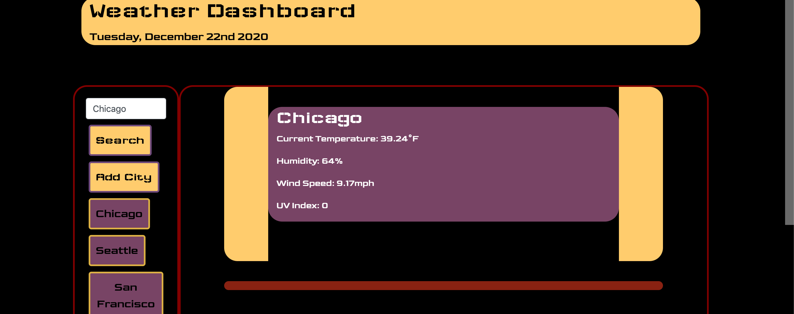

# weather-dashboard

Users enter city names into the search bar to view current weather data and a five-day forecast for a city of their choosing. If there is a city whose weather they would like to regularly view, there is a "save city" button which creates a handy button in the sidebar to allow them to access data for that city without using the "search" function. If they wish to simply view the city's weather information but don't want to save it, they can use the "search" button to do so without creating a button for that city. 

Site is deployed at: https://rachelns.github.io/weather-dashboard/

The below screenshots demonstrate the button sidebar, current weather view, and the five-day forecast. 

![5-Day Forecast] (Images/Screen Shot 2020-12-22 at 4.43.27 PM.png)
